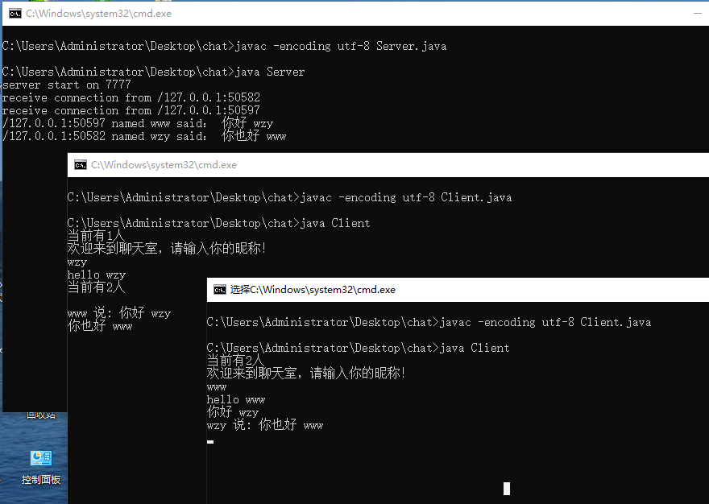

#基于NIO实现的聊天室
## 流程：
#### 服务端
* 服务器创建ServerSocket接受所有机器的连接，并设置读事件
* 当有读事件触发，遍历可读事件，广播到selector中的所有连接输出流中
#### 客户端
* 新建读线程：注册可读事件
* 服务器广播到该channel ===\>输出数据
#### 说明
服务端代码可以放到远端外网服务器上，修改Client的连接地址就好！
### 效果
